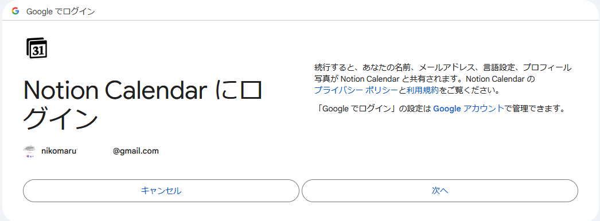

# 認可サーバーを実装してみた

Kotlin + KtorでOAuth2を作ってみた

    にこまる

---

# 自己紹介

- 📛 **名前** - にこまる
- 🏫 **所属** - 工学部電子情報システム工学科 2年
- 🌏 **出身** - 愛知県
- 🎨 **趣味**
    - 🎮 **ゲーム**
        - マインクラフト
    - 📝 **資格取得**
        - 世界遺産検定 3級
        - AWS Certified Cloud Practitioner(Expiration 2025-01), FE, AP

---
layout: default
---

# 目次

<Toc maxDepth="1"></Toc>

---

# OAuth2とは

OAuth2とは ・・・ 認可の仕組み 

OAuth2は、認可の仕組みを提供するプロトコル 

## 例
googleカレンダーをほかのアプリケーションから利用する場合、 
googleカレンダーのAPIを利用するためには、OAuth2を利用して認可を行う 

---

# OAuth2だと何がいい？

- **セキュリティ**
    - パスワードを他のアプリケーションに渡さなくてもよい
    - フロー側で、セキュリティについて考慮されている

- **利便性**
    - 他のアプリケーションのAPIを利用する際に、認可フローが共通なので認可を簡単に行える

---

# Kotlinについて

---

# 実際のコード

---

# Ktorについて

---

# フロントエンドについて

## 使用した技術

- フレームワーク: Next.js
- UIコンポーネント : Headless UI
    - UIライブラリ : [Ark ui](https://ark-ui.com/)
    - cssライブラリ : [Panda CSS](https://panda-css.com/)
    - コンポーネント : [Park UI](https://park-ui.com/)

## Headless UI

スタイルを持たず、機能だけを提供

---

# まとめ